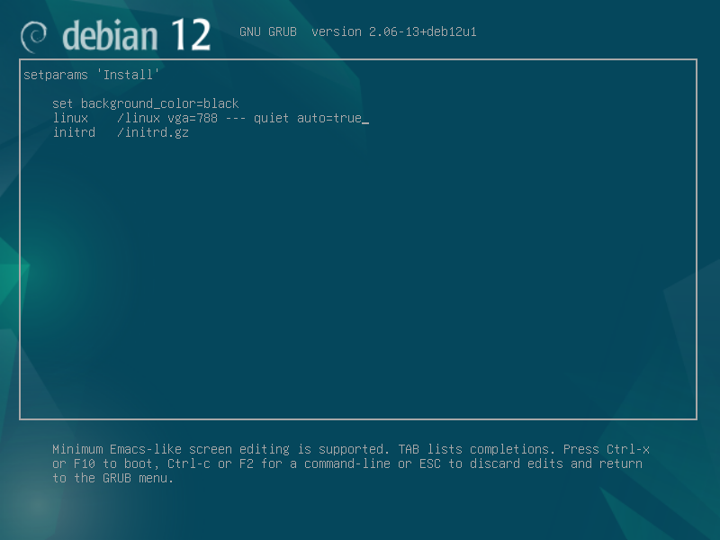
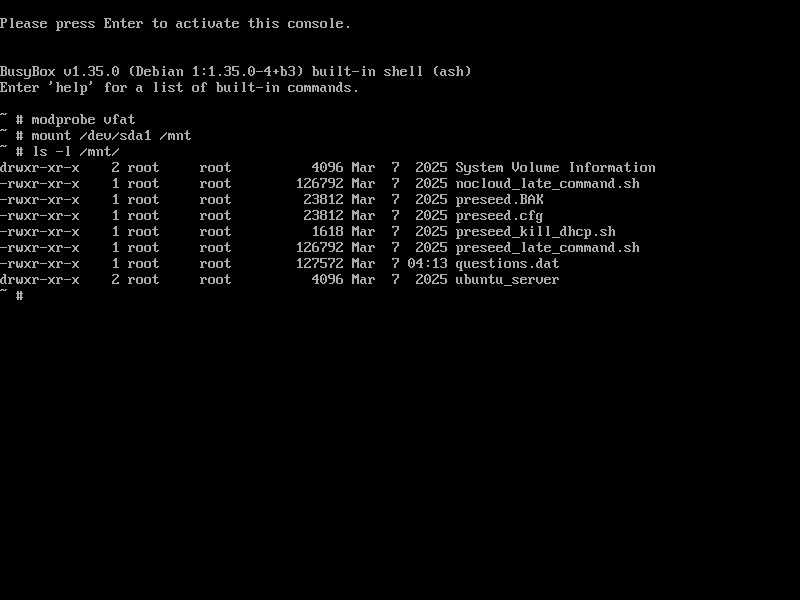
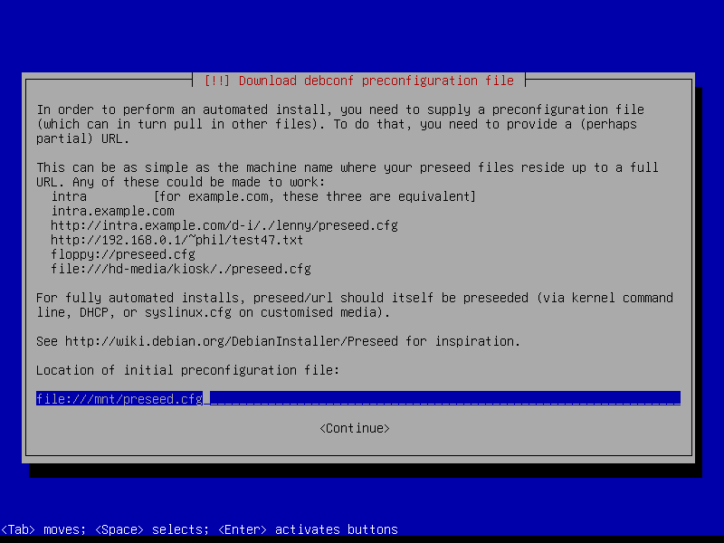

# **Create base system**  
  
## **Machine specs**  
  
### **Virtual machine**
  
VMware Workstation 16 Pro (16.2.5 build-20904516)
  
| device    | specification      | note                          |
| :-------- | :----------------- | :---------------------------- |
| processor | 1processor / 2core | core i7-6700                  |
| memory    | 4GiB               | Most distributions            |
| storage   | NVMe 500GiB        |                               |
| nic       | e1000e             |                               |
| sound     | ES1371             |                               |
  
### **Storage usage**  
  
| directory name        |   usage    | contents                        |
| :-------------------- | ---------: | :------------------------------ |
| /                     |     500GiB | root directory                  |
| /srv/                 |     480GiB | shared directory                |
| /srv/hgfs/            | (external) | vmware shared directory         |
| /srv/http/html/       |       1GiB | html contents                   |
| /srv/samba/           |       1GiB | samba shared directory (empty)  |
| /srv/tftp/            |       1GiB | tftp contents                   |
| /srv/user/            |     450GiB | user file                       |
| /srv/user/private/    |       1GiB | personal use                    |
| /srv/user/share/      |     450GiB | shared                          |
| /srv/user/share/conf/ |       1GiB | configuration file              |
| /srv/user/share/imgs/ |     150GiB | iso file extraction destination |
| /srv/user/share/isos/ |     150GiB | iso file                        |
| /srv/user/share/load/ |       5GiB | load module                     |
| /srv/user/share/rmak/ |     140GiB | remake file                     |
  
### **Install packages**  
  
|      package      |              debian / ubuntu                 | rhel (fedora,centos-stream,miraclelinux,...) |                   openSUSE                   |
| :---------------- | :------------------------------------------- | :------------------------------------------- | :------------------------------------------- |
| apparmor          | apparmor apparmor-utils                      |                                              |                                              |
| usrmerge          | usrmerge                                     |                                              |                                              |
| sudo              | sudo                                         | sudo                                         | sudo                                         |
| firewalld         | firewalld                                    | firewalld                                    | firewalld                                    |
| traceroute        | traceroute                                   | traceroute                                   | traceroute                                   |
| network manager   | connman                                      | NetworkManager                               | NetworkManager                               |
| bash-completion   | bash-completion                              | bash-completion                              | bash-completion                              |
| build-essential   | build-essential                              |                                              |                                              |
| curl              | curl                                         | curl                                         | curl                                         |
| vim               | vim                                          | vim                                          | vim                                          |
| bc                | bc                                           | bc                                           | bc                                           |
| tree              | tree                                         | tree                                         | tree                                         |
| shellcheck        | shellcheck                                   |                                              |                                              |
| clamav            | clamav                                       |                                              | clamav                                       |
| openssh-server    | openssh-server                               | openssh-server                               | openssh-server                               |
| systemd-resolved  | systemd-resolved                             | systemd-resolved                             | systemd-network                              |
| dnsmasq           | dnsmasq bind9-dnsutils                       | dnsmasq tftp-server bind-utils               | dnsmasq tftp bind-utils                      |
| apache2           | apache2                                      | httpd                                        | apache2                                      |
| samba             | samba smbclient cifs-utils libnss-winbind    | samba samba-client cifs-utils samba-winbind  | samba samba-client cifs-utils samba-winbind  |
| open-vm-tools     | open-vm-tools open-vm-tools-desktop          | open-vm-tools open-vm-tools-desktop fuse     | open-vm-tools open-vm-tools-desktop fuse     |
  
## **Automatic installation**  
  
### **Directory structure**  
  
* [Shared Directory](./Readme_tree_srv.md "/srv/")  
* [Configuration files](./Readme_tree_etc.md "/etc/")  
  
### **Download**  
  
1. [mini.iso](https://deb.debian.org/debian/dists/stable/main/installer-amd64/current/images/netboot/mini.iso "debian stable mini.iso")  
2. [preseed_kill_dhcp.sh](https://raw.githubusercontent.com/office-itou/Linux/refs/heads/master/shell-script/conf/preseed/preseed_kill_dhcp.sh)  
3. [preseed_late_command.sh](https://raw.githubusercontent.com/office-itou/Linux/refs/heads/master/shell-script/conf/preseed/preseed_late_command.sh)  
4. [ps_debian_server.cfg](https://raw.githubusercontent.com/office-itou/Linux/refs/heads/master/shell-script/conf/preseed/ps_debian_server.cfg)  
(There is a preseed file configuration example at the end of this page.)
  
### **Copy to USB stick**  
  
* Copy the downloaded files except for mini.iso to a USB stick.  
(The USB stick must be formatted in fat32 (vfat))
  
## **Start the installation**  
  
### **Boot from mini.iso**  
  
* Insert the media and start the computer.  
(Assuming UEFI mode)  
  
### **Editing command options**  
  
* When the menu appears, place the cursor on the 'Install' line and press the 'e' key.  
* Add auto=true to the end of the Linux line and press F10.  
  
  
  
### **Enter the hostname and domain name**  
  
* Enter the host name and domain name and press Enter.  
  
  
  
### **Load from USB stick**  
  
* When the console screen appears waiting for input, press 'Alt+F2'.  
* When the new screen opens, enter the following.  
(Assume the usb stick is /deb/sda1)  

  
``` bash:
modprobe vfat
mount /dev/sda1 /mnt
ls -l /mnt
```
  
  
  
### **Automatic installation process begins**  
  
* Press 'Alt+F1' to return to the original screen.  
* Enter the preseed file name and press Enter.  
(Assume the file name is /mnt/preseed.cfg)  
  
  
  
## **Booting the base system**  
  
* Once the installation is completed successfully, the system will reboot and start up into the base system.  
  
## **For reference**  
  
### **Editing the preseed file**  
  
* The following items should be effectively adapted to each environment.  
  
``` bash:
  d-i debian-installer/locale string ja_JP.UTF-8
  d-i debian-installer/language string ja
  d-i debian-installer/country string JP
  d-i localechooser/supported-locales multiselect en_US.UTF-8, ja_JP.UTF-8
  d-i keyboard-configuration/xkb-keymap select jp
  d-i keyboard-configuration/toggle select No toggling
  d-i netcfg/enable boolean true
  d-i netcfg/disable_autoconfig boolean true
  d-i netcfg/dhcp_options select Configure network manually
  d-i netcfg/get_ipaddress string 192.168.1.1
  d-i netcfg/get_netmask string 255.255.255.0
  d-i netcfg/get_gateway string 192.168.1.254
  d-i netcfg/get_nameservers string 192.168.1.254
  d-i netcfg/confirm_static boolean true
  d-i netcfg/get_hostname string sv-debian
  d-i netcfg/get_domain string workgroup
  d-i apt-setup/services-select multiselect security, updates, backports
  d-i preseed/run string \
      https://raw.githubusercontent.com/office-itou/Linux/refs/heads/master/shell-script/conf/preseed/preseed_kill_dhcp.sh
```
  
* If you can use bash...  
  
``` bash:
sed -e '\%debian-installer/locale[ \t]\+string%              s/^#./  /'        \
    -e '\%debian-installer/language[ \t]\+string%            s/^#./  /'        \
    -e '\%debian-installer/country[ \t]\+string%             s/^#./  /'        \
    -e '\%localechooser/supported-locales[ \t]\+multiselect% s/^#./  /'        \
    -e '\%keyboard-configuration/xkb-keymap[ \t]\+select%    s/^#./  /'        \
    -e '\%keyboard-configuration/toggle[ \t]\+select%        s/^#./  /'        \
    -e '\%netcfg/enable[ \t]\+boolean%                       s/^#./  /'        \
    -e '\%netcfg/disable_autoconfig[ \t]\+boolean%           s/^#./  /'        \
    -e '\%netcfg/dhcp_options[ \t]\+select%                  s/^#./  /'        \
    -e '\%IPv4 example%,\%IPv6 example% {                             '        \
    -e '\%netcfg/get_ipaddress[ \t]\+string%                 s/^#./  /'        \
    -e '\%netcfg/get_netmask[ \t]\+string%                   s/^#./  /'        \
    -e '\%netcfg/get_gateway[ \t]\+string%                   s/^#./  /'        \
    -e '\%netcfg/get_nameservers[ \t]\+string%               s/^#./  /'        \
    -e '\%netcfg/confirm_static[ \t]\+boolean%               s/^#./  /'        \
    -e '}'                                                                     \
    -e '\%netcfg/get_hostname[ \t]\+string%                  s/^#./  /'        \
    -e '\%netcfg/get_domain[ \t]\+string%                    s/^#./  /'        \
    -e '\%apt-setup/services-select[ \t]\+multiselect%       s/^#./  /'        \
    -e '\%preseed/run[ \t]\+string%,\%[^\\]$%                s/^#./  /'        \
    -e '\%apt-setup/services-select[ \t]\+multiselect%       s/$/, backports/' \
    -e '\%preseed/run[ \t]\+string%,\%[^\\]$%                s%http.:.*$%https://raw.githubusercontent.com/office-itou/Linux/refs/heads/master/shell-script/conf/preseed/preseed_kill_dhcp.sh%' \
    ps_debian_server.cfg \
>   preseed.cfg
```
  
### **Example of preseed file**  
  
``` bash:
#_preseed_V1
# *****************************************************************************
# Contents of the preconfiguration file (for debian) : x86/amd64 [lxde-desktop]
# *****************************************************************************
# == Unattended Installation ==================================================
##d-i auto-install/enable boolean true
  d-i debconf/priority select high
# d-i debconf/priority select low
# d-i hw-detect/load_firmware boolean true
##d-i hw-detect/select_modules multiselect usb-storage (USB storage)
# -- anna ---------------------------------------------------------------------
  d-i anna/choose_modules multiselect netcfg
# -- Live media ---------------------------------------------------------------
# d-i live-installer/net-image string _IMAGE_
# d-i live-installer/enable boolean false
# d-i live-installer/mode select normal
# d-i debian-installer/main-menu/item-failure error 
# d-i debian-installer/missing-provide select Install the system
# == Localization =============================================================
##d-i localechooser/translation/warn-light boolean true
##d-i localechooser/translation/warn-severe boolean true
##d-i debian-installer/locale select ja_JP.UTF-8
  d-i debian-installer/locale string ja_JP.UTF-8
  d-i debian-installer/language string ja
  d-i debian-installer/country string JP
  d-i localechooser/supported-locales multiselect en_US.UTF-8, ja_JP.UTF-8
  d-i localechooser/translation/warn-light boolean true
# -- Keyboard selection. ------------------------------------------------------
##d-i console-setup/ask_detect string false
  d-i keyboard-configuration/xkb-keymap select jp
  d-i keyboard-configuration/toggle select No toggling
##d-i keyboard-configuration/layoutcode string jp
##d-i keyboard-configuration/variant select Japanese
##d-i keyboard-configuration/modelcode string pc105
# == Network configuration ====================================================
##d-i netcfg/target_network_config select Network Manager
##d-i netcfg/target_network_config select ifupdown
  d-i netcfg/enable boolean true
#*d-i netcfg/choose_interface select auto
# d-i netcfg/choose_interface select eth1
# d-i netcfg/link_wait_timeout string 10
# d-i netcfg/dhcp_timeout string 60
# d-i netcfg/dhcpv6_timeout string 60
# -- Static network configuration. --------------------------------------------
  d-i netcfg/disable_autoconfig boolean true
# d-i netcfg/dhcp_failed note
##d-i netcfg/dhcp_options string Configure network manually
  d-i netcfg/dhcp_options select Configure network manually
# -- IPv4 example -------------------------------------------------------------
  d-i netcfg/get_ipaddress string 192.168.1.1
  d-i netcfg/get_netmask string 255.255.255.0
  d-i netcfg/get_gateway string 192.168.1.254
  d-i netcfg/get_nameservers string 192.168.1.254
#*d-i netcfg/get_ipaddress seen false
#*d-i netcfg/get_netmask seen false
#*d-i netcfg/get_gateway seen false
#*d-i netcfg/get_nameservers seen false
  d-i netcfg/confirm_static boolean true
# -- IPv6 example -------------------------------------------------------------
# d-i netcfg/get_ipaddress string fc00::2
# d-i netcfg/get_netmask string ffff:ffff:ffff:ffff::
# d-i netcfg/get_gateway string fc00::1
# d-i netcfg/get_nameservers string fc00::1
# d-i netcfg/confirm_static boolean true
# -- hostname and domain names ------------------------------------------------
  d-i netcfg/get_hostname string sv-debian
  d-i netcfg/get_domain string workgroup
#*d-i netcfg/get_hostname seen false
#*d-i netcfg/get_domain seen false
# d-i netcfg/hostname string somehost
# -- Disable that annoying WEP key dialog -------------------------------------
# d-i netcfg/wireless_wep string
# -- The wacky dhcp hostname that some ISPs use as a password of sorts --------
# d-i netcfg/dhcp_hostname string radish
# -- If you want to completely disable firmware lookup ------------------------
# d-i hw-detect/firmware-lookup string never
# -- If non-free firmware is needed for the network or other hardware ---------
# d-i hw-detect/load_firmware boolean true
# == Network console ==========================================================
# d-i anna/choose_modules string network-console
# d-i network-console/authorized_keys_url string http://10.0.0.1/openssh-key
# d-i network-console/password password r00tme
# d-i network-console/password-again password r00tme
# == Mirror settings ==========================================================
# d-i mirror/protocol string ftp
  d-i mirror/protocol string http
##d-i mirror/protocol string https
##d-i mirror/protocol select http
##d-i mirror/protocol select https
  d-i mirror/country string JP
##d-i mirror/http/countries select JP
  d-i mirror/http/hostname string deb.debian.org
  d-i mirror/http/directory string /debian
  d-i mirror/http/proxy string
  d-i mirror/http/mirror select deb.debian.org
##d-i mirror/https/countries select JP
##d-i mirror/https/hostname string deb.debian.org
##d-i mirror/https/directory string /debian
##d-i mirror/https/proxy string
##d-i mirror/https/mirror select deb.debian.org
# -- Suite to install ---------------------------------------------------------
# d-i mirror/suite string stable
# d-i mirror/suite string testing
##d-i mirror/suite select stable
##d-i mirror/suite select testing
# -- Suite to use for loading installer components (optional) -----------------
# d-i mirror/udeb/suite string testing
# == Account setup ============================================================
  d-i passwd/root-login boolean false
# d-i passwd/make-user boolean true
# -- Root password, either in clear text or encrypted -------------------------
# d-i passwd/root-password password r00tme
# d-i passwd/root-password-again password r00tme
# d-i passwd/root-password-crypted password [crypt(3) hash]
# -- Normal user's password, either in clear text or encrypted ----------------
  d-i passwd/user-fullname string Master
  d-i passwd/username string master
  d-i passwd/user-password password master
  d-i passwd/user-password-again password master
# d-i passwd/user-password-crypted password [crypt(3) hash]
# d-i passwd/user-uid string 1010
# d-i passwd/user-default-groups string audio cdrom video
# -----------------------------------------------------------------------------
  d-i user-setup/allow-password-weak string true
##d-i user-setup/encrypt-home string false
# == Clock and time zone setup ================================================
# d-i clock-setup/utc boolean true
  d-i time/zone select Asia/Tokyo
##d-i time/zone select Asia/Tokyo
##d-i clock-setup/hwclock-wait boolean false
##d-i clock-setup/system-time-changed boolean true
# -- Controls whether to use NTP to set the clock during the install ----------
# d-i clock-setup/ntp boolean true
  d-i clock-setup/ntp-server string ntp.nict.jp
# == Partitioning =============================================================
  d-i partman/unmount_active boolean true
# d-i partman/early_command string \
#     lvremove --select all -ff -y; \
#     vgremove --select all -ff -y; \
#     pvremove /dev/nvme0n1* -ff -y; \
#     dd if=/dev/zero of=/dev/nvme0n1 bs=1M count=10; \
#     umount /media || umount -l /media || true; \
#     exit 0;
# d-i partman-auto/init_automatically_partition select biggest_free
  d-i partman-auto/init_automatically_partition select lvm
  d-i partman-auto/disk string /dev/nvme0n1
# d-i partman-auto/disk string /dev/nvme0n1 /dev/sda
# d-i partman-auto/disk string /dev/sda
# d-i partman-auto/method string regular
  d-i partman-auto/method string lvm
# d-i partman-auto/method string crypto
# d-i partman-auto/method string raid
  d-i partman-auto-lvm/guided_size string max
##d-i partman-auto-lvm/new_vg_name string system
##d-i partman-auto-lvm/new_vg_name_exists string
# -----------------------------------------------------------------------------
  d-i partman-lvm/device_remove_lvm boolean true
##d-i partman-lvm/device_remove_lvm_span error true
  d-i partman-md/device_remove_md boolean true
  d-i partman-lvm/confirm boolean true
  d-i partman-lvm/confirm_nooverwrite boolean true
  d-i partman-auto/purge_lvm_from_device string true
  d-i partman-crypto/confirm_nooverwrite boolean false
# -----------------------------------------------------------------------------
  d-i partman-basicfilesystems/no_swap boolean false
##d-i partman-swapfile/percentage string 0
##d-i partman-swapfile/size string 0
# -----------------------------------------------------------------------------
  d-i partman-auto/choose_recipe select atomic
# d-i partman-auto/choose_recipe select home
# d-i partman-auto/choose_recipe select multi
# d-i partman-auto/expert_recipe_file string /hd-media/recipe
# -----------------------------------------------------------------------------
# /dev/nvme0n1p1: 512MB: efi
#      nvme0n1p2: 512MB: /boot
#      nvme0n1p3:    -1: vg00
# /dev/sda1     :    -1: vg01
# vg00-root     :    -1: /
# vg01-home     :    -1: /home
#
# d-i partman-auto/expert_recipe string                                       \
#         boot-lvm ::                                                         \
#               512   512   512 free                                          \
#                 $iflabel{ gpt } $reusemethod{ }                             \
#                 method{ efi } format{ }                                     \
#                 device{ /dev/nvme0n1p1 }                                    \
#             .                                                               \
#               512   512   512 ext3                                          \
#                 $primary{ } $bootable{ }                                    \
#                 method{ format } format{ }                                  \
#                 use_filesystem{ } filesystem{ ext3 }                        \
#                 mountpoint{ /boot }                                         \
#                 device{ /dev/nvme0n1p2 }                                    \
#             .                                                               \
#              1024  1024    -1 ext4                                          \
#                 $primary{ }                                                 \
#                 method{ lvm } vg_name{ vg00 }                               \
#                 device{ /dev/nvme0n1p3 }                                    \
#             .                                                               \
#              1024  1024    -1 ext4                                          \
#                 $primary{ }                                                 \
#                 method{ lvm } vg_name{ vg01 }                               \
#                 device{ /dev/sda1 }                                         \
#             .                                                               \
#              1024  1024    -1 ext4                                          \
#                 $lvmok{ } in_vg{ vg00 } lv_name{ root }                     \
#                 method{ format } format{ }                                  \
#                 use_filesystem{ } filesystem{ ext4 }                        \
#                 mountpoint{ / }                                             \
#             .                                                               \
#              1024  1024    -1 ext4                                          \
#                 $lvmok{ } in_vg{ vg01 } lv_name{ home }                     \
#                 method{ format } format{ }                                  \
#                 use_filesystem{ } filesystem{ ext4 }                        \
#                 mountpoint{ /home }                                         \
#             .
# -----------------------------------------------------------------------------
# d-i partman/default_filesystem string btrfs
# d-i partman/default_filesystem string ext4
# -- This makes partman automatically partition without confirmation. ---------
  d-i partman-partitioning/confirm_write_new_label boolean true
  d-i partman/choose_partition select finish
  d-i partman/confirm boolean true
  d-i partman/confirm_nooverwrite boolean true
  d-i partman-md/confirm boolean true
  d-i partman-md/confirm_nooverwrite boolean false
# -- Force UEFI booting ('BIOS compatibility' will be lost). Default: false. --
  d-i partman-efi/non_efi_system boolean true
# -- Ensure the partition table is GPT - this is required for EFI -------------
# d-i partman-partitioning/choose_label select gpt
# d-i partman-partitioning/default_label string gpt
# -- When disk encryption is enabled, skip wiping the partitions beforehand. --
  d-i partman-auto-crypto/erase_disks boolean true
# -- Controlling how partitions are mounted -----------------------------------
# d-i partman/mount_style select uuid
# == Base system installation =================================================
# d-i base-installer/install-recommends boolean true
##d-i base-installer/kernel/image select linux-image-amd64
# d-i base-installer/kernel/image string linux-image-686
# == Apt setup ================================================================
  d-i apt-setup/cdrom/set-first boolean false
  d-i apt-setup/cdrom/set-next boolean false
  d-i apt-setup/cdrom/set-failed boolean false
  d-i apt-setup/non-free-firmware boolean true
  d-i apt-setup/non-free boolean true
  d-i apt-setup/contrib boolean true
# d-i apt-setup/backports boolean true
# d-i apt-setup/proposed-updates boolean true
# d-i apt-setup/disable-cdrom-entries boolean false
  d-i apt-setup/use_mirror boolean true
  d-i apt-setup/services-select multiselect security, updates, backports
  d-i apt-setup/security_host string security.debian.org
# d-i apt-setup/local0/repository string http://local.server/debian stable main
# d-i apt-setup/local0/comment string local server
# d-i apt-setup/local0/source boolean true
# d-i apt-setup/local0/key string http://local.server/key
# d-i apt-setup/local0/key string base64://LS0tLS1CRUdJTiBQR1AgUFVCTElDIEtFWSBCTE9DSy0tLS0tCi4uLgo=
# d-i debian-installer/allow_unauthenticated boolean false
# d-i apt-setup/multiarch string i386
# == Package selection ========================================================
  tasksel tasksel/first multiselect \
    standard
# -----------------------------------------------------------------------------
  d-i pkgsel/run_tasksel boolean true
# -----------------------------------------------------------------------------
  d-i pkgsel/include string \
    apparmor apparmor-utils \
    usrmerge \
    sudo \
    firewalld \
    traceroute \
    connman \
    bash-completion \
    build-essential curl vim bc \
    tree shellcheck \
    clamav \
    openssh-server \
    systemd-resolved \
    dnsmasq bind9-dnsutils \
    apache2 \
    samba smbclient cifs-utils libnss-winbind \
    open-vm-tools open-vm-tools-desktop
#   task-desktop task-lxde-desktop task-laptop \
#   task-japanese task-japanese-desktop \
#   fonts-noto \
#   im-config zenity ibus-mozc fcitx5-mozc mozc-utils-gui gnome-shell-extensions \
#   libreoffice-l10n-ja libreoffice-help-ja \
#   firefox-esr-l10n-ja thunderbird thunderbird-l10n-ja \
#   rhythmbox ffmpeg
# -----------------------------------------------------------------------------
#   usrmerge \
# -----------------------------------------------------------------------------
#   systemd-resolved \
# -----------------------------------------------------------------------------
#   kasumi ibus-anthy \
#   ibus-mozc mozc-utils-gui \
# -----------------------------------------------------------------------------
#   pxelinux syslinux-common syslinux-efi
# -----------------------------------------------------------------------------
#   avahi-daemon
#   bind9 bind9-utils bind9-dnsutils resolvconf \
#   isc-dhcp-server \
#   minidlna \
# -----------------------------------------------------------------------------
# d-i pkgsel/upgrade select none
# d-i pkgsel/upgrade select safe-upgrade
  d-i pkgsel/upgrade select full-upgrade
##d-i pkgsel/update-policy select none
##d-i pkgsel/update-policy select unattended-upgrades
# -----------------------------------------------------------------------------
##d-i popularity-contest/participate string false
  popularity-contest popularity-contest/participate string false
# -----------------------------------------------------------------------------
  d-i pkgsel/install-language-support string true
##d-i shared/default-x-display-manager select gdm3
  d-i shared/default-x-display-manager select lightdm
# -----------------------------------------------------------------------------
  d-i samba-common/dhcp boolean false
# == Boot loader installation =================================================
  d-i grub-installer/only_debian boolean true
  d-i grub-installer/with_other_os boolean false
  d-i grub-installer/bootdev string default
# d-i grub-installer/bootdev string /dev/sda
# d-i grub-installer/bootdev string (hd0,1)
# d-i grub-installer/bootdev string (hd0,1) (hd1,1) (hd2,1)
##d-i grub-installer/force-efi-extra-removable boolean true
# -- Optional password for grub, either in clear text or encrypted ------------
# Optional password for grub, either in clear text
# d-i grub-installer/password password r00tme
# d-i grub-installer/password-again password r00tme
# d-i grub-installer/password-crypted password [MD5 hash]
# --- Use the following option to add additional boot parameters --------------
# d-i debian-installer/add-kernel-opts string nousb
# == Finishing up the installation ============================================
# d-i finish-install/keep-consoles boolean false
  d-i finish-install/reboot_in_progress note
##d-i cdrom-detect/eject string false
# d-i cdrom-detect/eject boolean false
  d-i cdrom-detect/eject boolean true
# d-i debian-installer/exit/halt boolean false
# d-i debian-installer/exit/poweroff boolean false
# == Running custom commands during the installation ==========================
  d-i preseed/run string \
      https://raw.githubusercontent.com/office-itou/Linux/refs/heads/master/shell-script/conf/preseed/preseed_kill_dhcp.sh
# d-i preseed/early_command string \
#     log-output dd if=/dev/zero of=/dev/nvme0n1 bs=1M count=100; \
#     exit 0;
# d-i partman/early_command string debconf-set partman-auto/disk "$(list-devices disk | head -n1)"
# d-i preseed/early_command string \
#     exec 2>&1; \
#     export LANG=C; \
#     mkdir -p /run/systemd/resolve; \
#     cp /etc/resolv.conf /run/systemd/resolve/stub-resolv.conf; \
#     exit 0;
  d-i partman/early_command string \
      lvremove --select all -ff -y; \
      vgremove --select all -ff -y; \
      pvremove /dev/nvme0n1* -ff -y; \
      dd if=/dev/zero of=/dev/nvme0n1 bs=1M count=10; \
      umount /media || umount -l /media || true; \
      if [ ! -e /run/systemd/resolve/stub-resolv.conf ]; then \
        mkdir -p /run/systemd/resolve; \
        cp /etc/resolv.conf /run/systemd/resolve/stub-resolv.conf; \
      fi; \
      exit 0;
  d-i preseed/late_command string \
      exec 2>&1; \
      export LANG=C; \
      if [ -d "/target/." ]; then \
        DIRS_TGET="/target"; \
      fi; \
      FUNC_NAME="late_command"; \
      LOGS_NAME="${DIRS_TGET:-}/var/adm/installer/${FUNC_NAME}.$(date +"%Y%m%d%H%M%S").log"; \
      mkdir -p "${LOGS_NAME%/*}"; \
      chmod 0600 "${LOGS_NAME%/*}"; \
      echo "### start ${FUNC_NAME} ###" >> "${LOGS_NAME}" 2>&1; \
      SEED_FILE=""; \
      if [ -f /var/lib/cdebconf/questions.dat ]; then \
        SEED_FILE="$(awk '$1=="Name:"&&($2=="preseed/url"||$2=="preseed/file"),$1=="" {if ($1=="Value:") {print $2;}}' /var/lib/cdebconf/questions.dat)"; \
      fi; \
      COMD_LINE="$(cat /proc/cmdline)"; \
      for LINE in ${COMD_LINE:-}; \
      do \
        case "${LINE}" in \
          debug | debugout | dbg | dbgout) DBGS_FLAG="true"                                     ;; \
          iso-url=*.iso  | url=*.iso     )                                                      ;; \
          preseed/url=*  | url=*         ) SEED_FILE="${SEED_FILE:-"${LINE#*url=}"}"            ;; \
          preseed/file=* | file=*        ) SEED_FILE="${SEED_FILE:-"${LINE#*file=}"}"           ;; \
          ds=nocloud*                    ) SEED_FILE="${SEED_FILE:-"${LINE#*ds=nocloud*=}"}";      \
                                           SEED_FILE="${SEED_FILE:-"${SEED_FILE%%/}/user-data"}";; \
          *)  ;; \
        esac; \
      done; \
      SEED_FILE="${SEED_FILE:-"/"}"; \
      if [ "${DBGS_FLAG:-}" = "true" ]; then \
        set -x; \
        echo "### debug out ${FUNC_NAME} ###" >> "${LOGS_NAME}" 2>&1; \
        echo "${FUNC_NAME}: COMD_LINE=[${COMD_LINE:-}]" >> "${LOGS_NAME}" 2>&1; \
        echo "${FUNC_NAME}: SEED_FILE=[${SEED_FILE:-}]" >> "${LOGS_NAME}" 2>&1; \
        echo "${FUNC_NAME}: DIRS_TGET=[${DIRS_TGET:-}]" >> "${LOGS_NAME}" 2>&1; \
      fi; \
      if [ -n "${SEED_FILE#/}" ]; then \
        echo "### initialization ${FUNC_NAME} ###" >> "${LOGS_NAME}" 2>&1; \
        SHEL_DIRS="/var/adm/installer/preseed" \
        SHEL_NAME="preseed_late_command.sh"; \
        SHEL_FILE="${SEED_FILE%/*}/${SHEL_NAME}"; \
        SHEL_EXEC="${SHEL_DIRS}/${SHEL_NAME}"; \
        SEED_PATH="${SHEL_DIRS}/${SEED_FILE##*/}"; \
        echo "### get seed  ${FUNC_NAME} [${SEED_FILE}] ###" >> "${LOGS_NAME}" 2>&1; \
        echo "### get shell ${FUNC_NAME} [${SHEL_FILE}] ###" >> "${LOGS_NAME}" 2>&1; \
        mkdir -p "${DIRS_TGET:-}${SHEL_DIRS}"; \
        case "${SEED_FILE}" in \
          http://* | https://* ) wget -O "${DIRS_TGET:-}${SEED_PATH}" "${SEED_FILE}" >> "${LOGS_NAME}" 2>&1; \
                                 wget -O "${DIRS_TGET:-}${SHEL_EXEC}" "${SHEL_FILE}" >> "${LOGS_NAME}" 2>&1;; \
          file://* | /*        ) cp -a "${SEED_FILE#file:/}" "${DIRS_TGET:-}${SEED_PATH}" >> "${LOGS_NAME}" 2>&1; \
                                 cp -a "${SHEL_FILE#file:/}" "${DIRS_TGET:-}${SHEL_EXEC}" >> "${LOGS_NAME}" 2>&1;; \
          *)  ;; \
        esac; \
        if [ "${DBGS_FLAG:-}" = "true" ]; then \
          echo "### debug out ${FUNC_NAME} ###" >> "${LOGS_NAME}" 2>&1; \
          echo "${FUNC_NAME}: SHEL_NAME=[${SHEL_NAME:-}]" >> "${LOGS_NAME}" 2>&1; \
          echo "${FUNC_NAME}: SHEL_FILE=[${SHEL_FILE:-}]" >> "${LOGS_NAME}" 2>&1; \
          echo "${FUNC_NAME}: SHEL_EXEC=[${SHEL_EXEC:-}]" >> "${LOGS_NAME}" 2>&1; \
          echo "${FUNC_NAME}: SEED_PATH=[${SEED_PATH:-}]" >> "${LOGS_NAME}" 2>&1; \
        fi; \
        if [ -e "${DIRS_TGET:-}${SHEL_EXEC}" ]; then \
          echo "### exec shell ${FUNC_NAME} [${DIRS_TGET:-}${SHEL_EXEC}] ###" >> "${LOGS_NAME}" 2>&1; \
          chmod +x "${DIRS_TGET:-}${SHEL_EXEC}"; \
          if [ -n "${DIRS_TGET:-}" ]; then \
            if [ -n "${SUBIQUITY_ROOT:-}" ]; then \
              echo "### exec shell ${FUNC_NAME} [curtin] [${DIRS_TGET:-}${SHEL_EXEC}] ###" >> "${LOGS_NAME}" 2>&1; \
              curtin in-target --target="${DIRS_TGET:-}" -- sh -c "${SHEL_EXEC}" >> "${LOGS_NAME}" 2>&1; \
            else \
              echo "### exec shell ${FUNC_NAME} [in-target] [${DIRS_TGET:-}${SHEL_EXEC}] ###" >> "${LOGS_NAME}" 2>&1; \
              in-target --pass-stdout sh -c "${SHEL_EXEC}" >> "${LOGS_NAME}" 2>&1; \
            fi; \
          fi; \
          echo "### complete shell ${FUNC_NAME} [${DIRS_TGET:-}${SHEL_EXEC}] ###" >> "${LOGS_NAME}" 2>&1; \
        fi; \
      fi; \
      echo "### complete ${FUNC_NAME} ###" >> "${LOGS_NAME}" 2>&1; \
      exit 0;
# d-i preseed/late_command string \
#     in-target --pass-stdout systemctl disable connman.service;
# == Preseeding other packages ================================================
# d-i debhelper debconf-utils
#   echo "#_preseed_V1" > file
#   debconf-get-selections --installer >> file
#   debconf-get-selections >> file
#   debconf-set-selections -c preseed.cfg
# == End Of File ==============================================================
```
  
