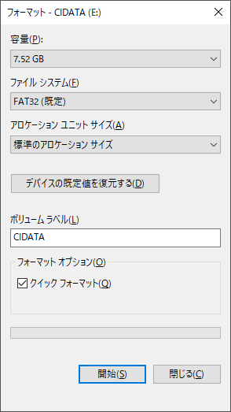
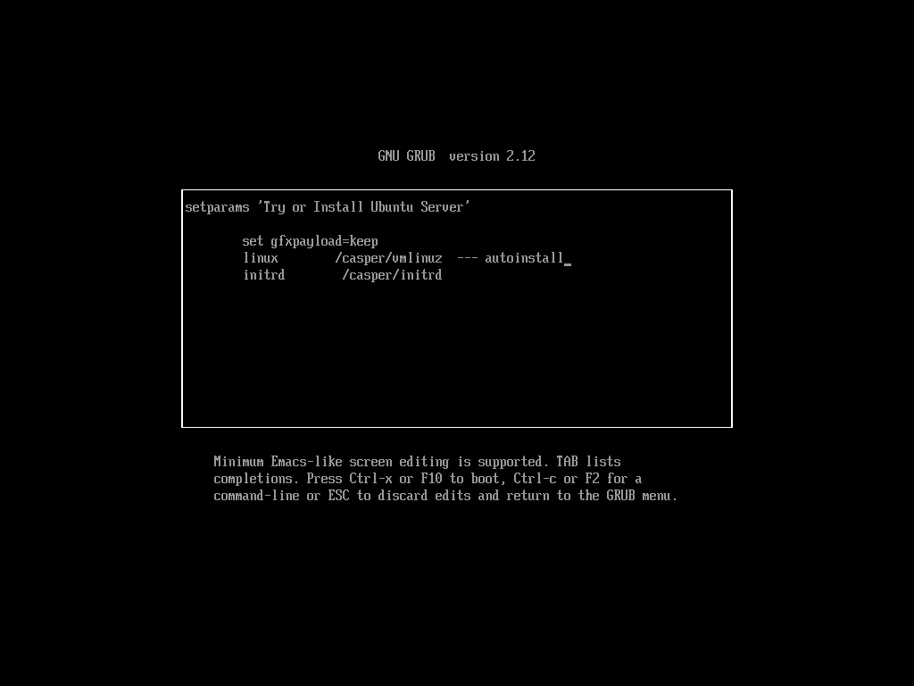

# **Creating a base system for Ubuntu**  
  
## **Automatic installation**  
  
### **Directory structure**  
  
* [Shared Directory](./Readme_tree_srv.md "/srv/")  
* [Configuration files](./Readme_tree_etc.md "/etc/")  
  
### **Download**  
  
1. [ubuntu-24.04.2-live-server-amd64.iso](https://releases.ubuntu.com/noble/ubuntu-24.04.2-live-server-amd64.iso "Ubuntu 24.04 (Noble Numbat)")  
2. [meta-data](https://raw.githubusercontent.com/office-itou/Linux/refs/heads/master/shell-script/conf/nocloud/ubuntu_server/meta-data)
3. [network-config](https://raw.githubusercontent.com/office-itou/Linux/refs/heads/master/shell-script/conf/nocloud/ubuntu_server/network-config)
4. [nocloud_late_command.sh](https://raw.githubusercontent.com/office-itou/Linux/refs/heads/master/shell-script/conf/nocloud/ubuntu_server/nocloud_late_command.sh)
5. [vendor-data](https://raw.githubusercontent.com/office-itou/Linux/refs/heads/master/shell-script/conf/nocloud/ubuntu_server/vendor-data)
6. [user-data](https://raw.githubusercontent.com/office-itou/Linux/refs/heads/master/shell-script/Readme_create_base_system/Ubuntu_cloud-init/user-data)
(There is a user-data file configuration example at the end of this page.)
  
### **Copy to USB stick**  
  
* Formatting a USB stick and setting the volume label.  
(The USB stick must be formatted in fat32 (vfat))  
  
  
  
* Copy the downloaded files except for ubuntu-24.04.2-live-server-amd64.iso to a USB stick.  
  
## **Start the installation**  
  
### **Boot from ubuntu-24.04.2-live-server-amd64.iso**  
  
* Insert the media and start the computer.  
(Assuming UEFI mode)  
  
### **Editing command options**  
  
* When the menu appears, place the cursor on the 'Try or Install Ubuntu Server' line and press the 'e' key.  
* Add autoinstall to the end of the Linux line and press F10.  
  
  
  
## **Booting the base system**  
  
* Once the installation is completed successfully, the system will reboot and start up into the base system.  
  
## **For reference**  
  
### **Editing the preseed file**  
  
* The following items should be effectively adapted to each environment.  
  
``` bash:
  network:
    version: 2
    ethernets:
      any:
        match:
          name: "en*"
        dhcp4: false
        addresses:
        - 192.168.1.1/24
        gateway4: 192.168.1.254
        nameservers:
          search:
          - workgroup
          addresses:
          - ::1
          - 127.0.0.1
          - 192.168.1.254
        dhcp6: true
        ipv6-privacy: true
```
  
* If you can use bash...  
  
``` bash:
wget -O - https://raw.githubusercontent.com/office-itou/Linux/refs/heads/master/shell-script/conf/nocloud/ubuntu_server/user-data | \
sed -e '/^#[ \t]\+[-=]\+[ \t]\+ipv4:[ \t]\+static[ \t]\+[-=]\+$/,/^\# [-=]\+\(\|[ \t]\+ipv4:[ \t]\+.*\)[-=]\+\(\|.*\)$/{' \
    -e '/^\# [-=]\+\(\|[ \t]\+ipv4:[ \t]\+.*\)[-=]\+\(\|.*\)$/! s/^#/ /g}' \
>   user-data

```
  
