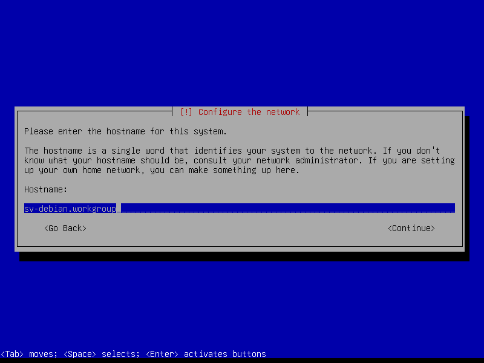
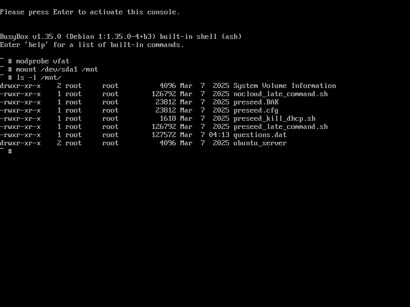
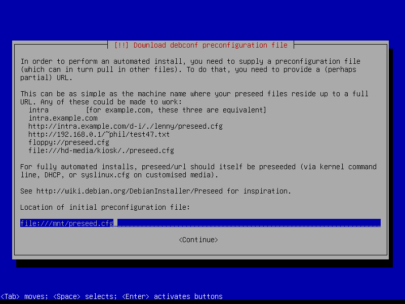

# **Create base system**  
  
## **Machine specs**  
  
### **Virtual machine**
  
VMware Workstation 16 Pro (16.2.5 build-20904516)
  
| device    | specification      | note                          |
| :-------- | :----------------- | :---------------------------- |
| processor | 1processor / 2core | core i7-6700                  |
| memory    | 4GiB               | Most distributions            |
| storage   | NVMe 500GiB        |                               |
| nic       | e1000e             |                               |
| sound     | ES1371             |                               |
  
## **Automatic installation**  
  
### **Directory structure**  
  
* [Shared Directory](./Readme_tree_srv.md "/srv/")  
* [Configuration files](./Readme_tree_etc.md "/etc/")  
  
### **Download**  
  
1. [mini.iso](https://deb.debian.org/debian/dists/stable/main/installer-amd64/current/images/netboot/mini.iso "debian stable mini.iso")  
2. [preseed_kill_dhcp.sh](https://raw.githubusercontent.com/office-itou/Linux/refs/heads/master/shell-script_prototype/conf/preseed/preseed_kill_dhcp.sh)  
3. [preseed_late_command.sh](https://raw.githubusercontent.com/office-itou/Linux/refs/heads/master/shell-script_prototype/conf/preseed/preseed_late_command.sh)  
4. [ps_debian_server.cfg](https://raw.githubusercontent.com/office-itou/Linux/refs/heads/master/shell-script_prototype/conf/preseed/ps_debian_server.cfg)  
  
### **Copy to USB stick**  
  
* Copy the downloaded files except for mini.iso to a USB stick.  
(The USB stick must be formatted in fat32 (vfat))
  
## **Start the installation**  
  
### **Boot from mini.iso**  
  
* Insert the media and start the computer.  
(Assuming UEFI mode)  
  
### **Editing command options**  
  
* When the menu appears, place the cursor on the 'Install' line and press the 'e' key.  
* Add auto=true to the end of the Linux line and press F10.  
  
  
  
### **Enter the hostname and domain name**  
  
* Enter the host name and domain name and press Enter.  
  
  
  
### **Load from USB stick**  
  
* When the console screen appears waiting for input, press 'Alt+F2'.  
* When the new screen opens, enter the following.  
(Assume the usb stick is /deb/sda1)  

  
``` bash:
modprobe vfat
mount /dev/sda1 /mnt
ls -l /mnt
```
  
  
  
### **Automatic installation process begins**  
  
* Press 'Alt+F1' to return to the original screen.  
* Enter the preseed file name and press Enter.  
(Assume the file name is /mnt/preseed.cfg)  
  
  
  
## **Booting the base system**  
  
* Once the installation is completed successfully, the system will reboot and start up into the base system.  
  
## **For reference**  
  
* The following items should be effectively adapted to each environment.  
  
``` bash:
  d-i debian-installer/locale string ja_JP.UTF-8
  d-i debian-installer/language string ja
  d-i debian-installer/country string JP
  d-i localechooser/supported-locales multiselect en_US.UTF-8, ja_JP.UTF-8
  d-i keyboard-configuration/xkb-keymap select jp
  d-i keyboard-configuration/toggle select No toggling
  d-i netcfg/enable boolean true
  d-i netcfg/disable_autoconfig boolean true
  d-i netcfg/dhcp_options select Configure network manually
  d-i netcfg/get_ipaddress string 192.168.1.1
  d-i netcfg/get_netmask string 255.255.255.0
  d-i netcfg/get_gateway string 192.168.1.254
  d-i netcfg/get_nameservers string 192.168.1.254
  d-i netcfg/confirm_static boolean true
  d-i netcfg/get_hostname string sv-debian
  d-i netcfg/get_domain string workgroup
  d-i apt-setup/services-select multiselect security, updates, backports
  d-i preseed/run string \
      https://raw.githubusercontent.com/office-itou/Linux/refs/heads/master/shell-script_prototype/conf/preseed/preseed_kill_dhcp.sh
```
  
* If you can use bash...  
  
``` bash:
sed -e '\%debian-installer/locale[ \t]\+string%              s/^#./  /'        \
    -e '\%debian-installer/language[ \t]\+string%            s/^#./  /'        \
    -e '\%debian-installer/country[ \t]\+string%             s/^#./  /'        \
    -e '\%localechooser/supported-locales[ \t]\+multiselect% s/^#./  /'        \
    -e '\%keyboard-configuration/xkb-keymap[ \t]\+select%    s/^#./  /'        \
    -e '\%keyboard-configuration/toggle[ \t]\+select%        s/^#./  /'        \
    -e '\%netcfg/enable[ \t]\+boolean%                       s/^#./  /'        \
    -e '\%netcfg/disable_autoconfig[ \t]\+boolean%           s/^#./  /'        \
    -e '\%netcfg/dhcp_options[ \t]\+select%                  s/^#./  /'        \
    -e '\%IPv4 example%,\%IPv6 example% {                             '        \
    -e '\%netcfg/get_ipaddress[ \t]\+string%                 s/^#./  /'        \
    -e '\%netcfg/get_netmask[ \t]\+string%                   s/^#./  /'        \
    -e '\%netcfg/get_gateway[ \t]\+string%                   s/^#./  /'        \
    -e '\%netcfg/get_nameservers[ \t]\+string%               s/^#./  /'        \
    -e '\%netcfg/confirm_static[ \t]\+boolean%               s/^#./  /'        \
    -e '}'                                                                     \
    -e '\%netcfg/get_hostname[ \t]\+string%                  s/^#./  /'        \
    -e '\%netcfg/get_domain[ \t]\+string%                    s/^#./  /'        \
    -e '\%apt-setup/services-select[ \t]\+multiselect%       s/^#./  /'        \
    -e '\%preseed/run[ \t]\+string%,\%[^\\]$%                s/^#./  /'        \
    -e '\%apt-setup/services-select[ \t]\+multiselect%       s/$/, backports/' \
    -e '\%preseed/run[ \t]\+string%,\%[^\\]$%                s%http.:.*$%https://raw.githubusercontent.com/office-itou/Linux/refs/heads/master/shell-script_prototype/conf/preseed/preseed_kill_dhcp.sh%' \
    ps_debian_server.cfg \
>   preseed.cfg
```
  
