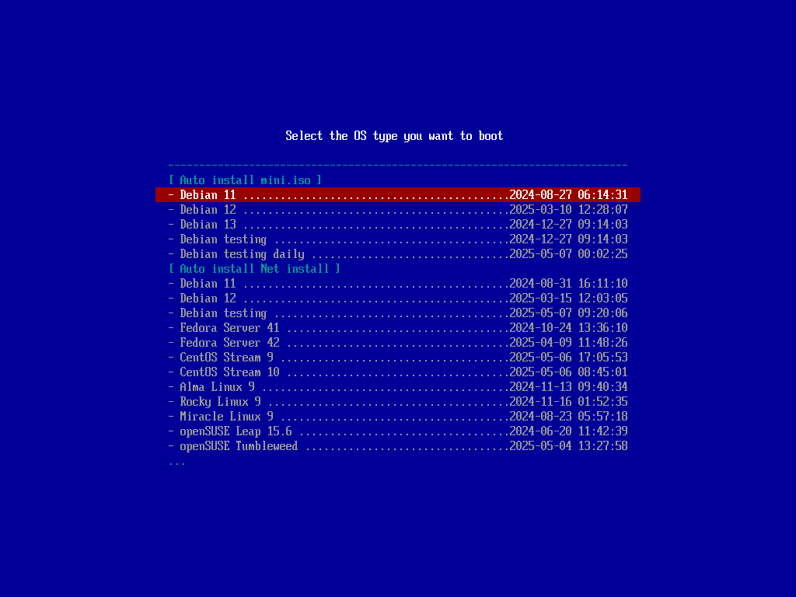
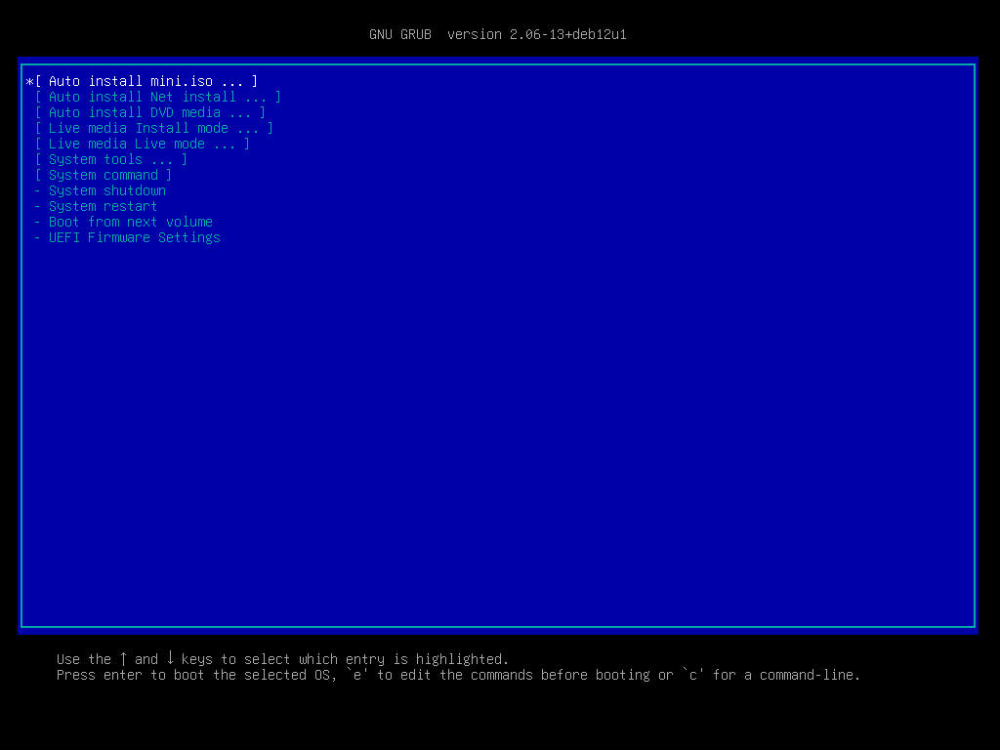
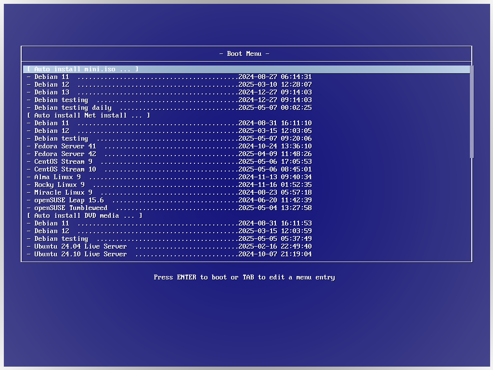

# **pxe boot**  
  
There are the following types.  

* **ipxe** (If you use Windows, this is the best choice)  
  
  
  
* **grub** (Easy parameter changes)  
  
  
  
* **syslinux** (Classic Features)  
  
  
  
## **tree diagram (for debian)**  
  
### **/etc/**  
  
``` bash:
/etc/
`-- dnsmasq.d
    |-- default.conf ------------------ dnsmasq configuration file
    `-- pxeboot.conf ------------------ pxeboot configuration file
        pxeboot_grub.conf
        pxeboot_ipxe.conf
        pxeboot_syslinux.conf
```
  
### **/srv/**  
  
``` bash:
/srv/
|-- http
|   `-- html -------------------------- html contents
|       |-- index.html
|       |-- conf -> /srv/user/share/conf
|       |-- imgs -> /srv/user/share/imgs
|       |-- isos -> /srv/user/share/isos
|       |-- load -> /srv/user/share/load
|       `-- rmak -> /srv/user/share/rmak
|-- tftp ------------------------------ tftp contents
|   |-- autoexec.ipxe ----------------- ipxe script file (menu file)
|   |-- boot
|   |   `-- grub
|   |       |-- bootnetx64.efi -------- bootloader (x86_64-efi)
|   |       |-- grub.cfg -------------- menu base
|   |       |-- pxelinux.0 ------------ bootloader (i386-pc-pxe)
|   |       |-- fonts
|   |       |   `-- unicode.pf2
|   |       |-- i386-efi
|   |       |-- i386-pc
|   |       |-- locale
|   |       `-- x86_64-efi
|   |-- conf -> /srv/user/share/conf
|   |-- imgs -> /srv/user/share/imgs
|   |-- ipxe -------------------------- ipxe module
|   |   |-- ipxe.efi -------------------------- for efi boot mode
|   |   |-- undionly.kpxe --------------------- for mbr boot mode
|   |   `-- wimboot --------------------------- for windows media
|   |-- isos -> /srv/user/share/isos
|   |-- load -> /srv/user/share/load
|   |-- menu-bios
|   |   |-- lpxelinux.0 --------------- bootloader (i386-pc)
|   |   |-- syslinux.cfg -------------- syslinux configuration for mbr environment
|   |   |-- conf -> ../conf
|   |   |-- imgs -> ../imgs
|   |   |-- isos -> ../isos
|   |   |-- load -> ../load
|   |   |-- pxelinux.cfg
|   |   |   `-- default -> ../syslinux.cfg
|   |   `-- rmak -> ../rmak
|   `-- menu-efi64
|       |-- syslinux.cfg -------------- syslinux configuration for uefi(x86_64) environment
|       |-- syslinux.efi -------------- bootloader (x86_64-efi)
|       |-- conf -> ../conf
|       |-- imgs -> ../imgs
|       |-- isos -> ../isos
|       |-- load -> ../load
|       |-- pxelinux.cfg
|       |   `-- default -> ../syslinux.cfg
|       `-- rmak -> ../rmak
`-- user ------------------------------ user file
    `-- share ------------------------- shared
        |-- conf ---------------------- configuration file
        |   |-- _data ----------------- common data files
        |   |   |-- common.cfg ---------------- configuration file of common
        |   |   `-- media.dat ----------------- data file of media
        |   |-- _fixed_address
        |   |   |-- autoinst.xml
        |   |   |-- kickstart.cfg
        |   |   |-- preseed.cfg
        |   |   `-- user-data
        |   |-- _keyring -------------- keyring file
        |   |   |-- debian-keyring.gpg
        |   |   `-- ubuntu-archive-keyring.gpg
        |   |-- _template ------------- templates for various configuration files
        |   |   |-- kickstart_rhel.cfg -------- for rhel
        |   |   |-- preseed_debian.cfg -------- for debian
        |   |   |-- preseed_ubuntu.cfg -------- for ubuntu
        |   |   |-- user-data_ubuntu ---------- for ubuntu cloud-init
        |   |   `-- yast_opensuse.xml --------- for opensuse
        |   |-- autoyast -------------- configuration files for opensuse
        |   |-- kickstart ------------- "                   for rhel
        |   |-- nocloud --------------- "                   for ubuntu cloud-init
        |   |-- preseed --------------- "                   for debian/ubuntu preseed
        |   |-- script ---------------- script files
        |   |   |-- autoinst_cmd_early.sh ----- for auto install early command
        |   |   |-- autoinst_cmd_late.sh ------ "                late command
        |   |   |-- autoinst_cmd_part.sh ------ "                early command after partman
        |   |   `-- autoinst_cmd_run.sh ------- "                preseed/run
        |   `-- windows --------------- configuration files for windows
        |       |-- WinREexpand.cmd ----------- hotfix for windows 10
        |       |-- WinREexpand_bios.sub ------ "
        |       |-- WinREexpand_uefi.sub ------ "
        |       |-- bypass.cmd ---------------- installation restriction bypass command for windows 11
        |       |-- inst_w10.cmd -------------- installation batch file for windows 10
        |       |-- inst_w11.cmd -------------- "                       for windows 11
        |       |-- shutdown.cmd -------------- shutdown command for winpe
        |       |-- startnet.cmd -------------- startup command for winpe
        |       |-- unattend.xml -------------- auto-installation configuration file for windows 10/11
        |       `-- winpeshl.ini
        |-- imgs ---------------------- iso file extraction destination
        |-- isos ---------------------- iso file
        |-- load ---------------------- load module
        `-- rmak ---------------------- remake file
```
  